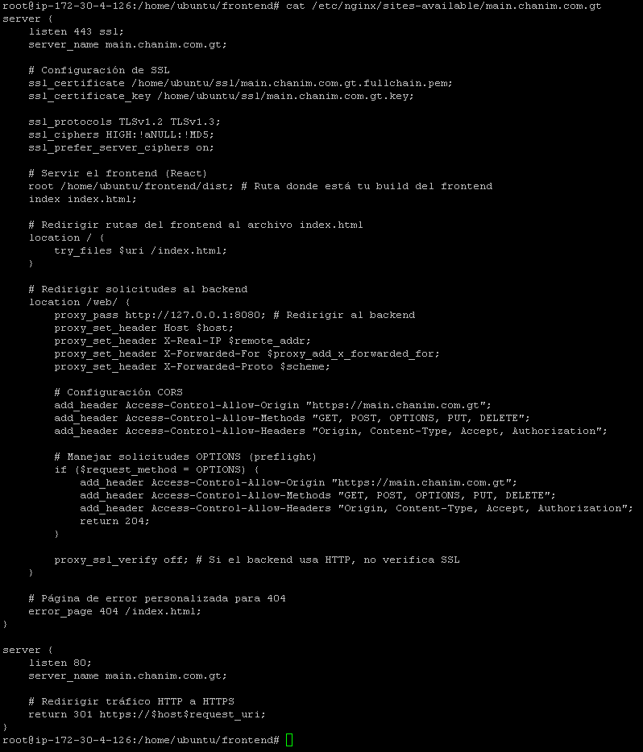

# Configuración REACT

```bash
# Crear Archivo
sudo nano /etc/nginx/sites-available/main.chanim.com.gt
```

```bash
server {
    listen 443 ssl;
    server_name main.chanim.com.gt;

    # Configuración de SSL
    ssl_certificate /home/ubuntu/ssl/main.chanim.com.gt.fullchain.pem;
    ssl_certificate_key /home/ubuntu/ssl/main.chanim.com.gt.key;

    ssl_protocols TLSv1.2 TLSv1.3;
    ssl_ciphers HIGH:!aNULL:!MD5;
    ssl_prefer_server_ciphers on;

    # Servir el frontend (React)
    root /home/ubuntu/frontend/dist;
    index index.html;

    location / {
        try_files $uri /index.html;
    }

    location /web/ {
        proxy_pass https://localhost:8080/;
        proxy_set_header Host $host;
        proxy_set_header X-Real-IP $remote_addr;
        proxy_set_header X-Forwarded-For $proxy_add_x_forwarded_for;
        proxy_set_header X-Forwarded-Proto $scheme;

        # Encabezados CORS
        add_header Access-Control-Allow-Origin "https://main.chanim.com.gt";
        add_header Access-Control-Allow-Methods "GET, POST, OPTIONS, PUT, DELETE";
        add_header Access-Control-Allow-Headers "Origin, Content-Type, Accept, Authorization";

        # Manejar solicitudes OPTIONS (preflight)
        if ($request_method = OPTIONS) {
            add_header Access-Control-Allow-Origin "https://main.chanim.com.gt";
            add_header Access-Control-Allow-Methods "GET, POST, OPTIONS, PUT, DELETE";
            add_header Access-Control-Allow-Headers "Origin, Content-Type, Accept, Authorization";
            return 204;
        }

        proxy_ssl_verify off;
    }

    error_page 404 /index.html;
}

server {
    listen 80;
    server_name main.chanim.com.gt;

    # Redirige todo el tráfico HTTP a HTTPS
    return 301 https://$host$request_uri;
}
```

# Configuración nginx producción
- ser muy cuidadosos con los /
```bash
server {
    listen 443 ssl;
    server_name main.chanim.com.gt;

    # Configuración de SSL
    ssl_certificate /home/ubuntu/ssl/main.chanim.com.gt.fullchain.pem;
    ssl_certificate_key /home/ubuntu/ssl/main.chanim.com.gt.key;

    ssl_protocols TLSv1.2 TLSv1.3;
    ssl_ciphers HIGH:!aNULL:!MD5;
    ssl_prefer_server_ciphers on;

    # Servir el frontend (React)
    root /home/ubuntu/frontend/dist; # Ruta donde está tu build del frontend
    index index.html;

    # Redirigir rutas del frontend al archivo index.html
    location / {
        try_files $uri /index.html;
    }

    # Redirigir solicitudes al backend
    location /web/ {
        proxy_pass http://127.0.0.1:8080; # Redirigir al backend
        proxy_set_header Host $host;
        proxy_set_header X-Real-IP $remote_addr;
        proxy_set_header X-Forwarded-For $proxy_add_x_forwarded_for;
        proxy_set_header X-Forwarded-Proto $scheme;

        # Configuración CORS
        add_header Access-Control-Allow-Origin "https://main.chanim.com.gt";
        add_header Access-Control-Allow-Methods "GET, POST, OPTIONS, PUT, DELETE";
        add_header Access-Control-Allow-Headers "Origin, Content-Type, Accept, Authorization";

        # Manejar solicitudes OPTIONS (preflight)
        if ($request_method = OPTIONS) {
            add_header Access-Control-Allow-Origin "https://main.chanim.com.gt";
            add_header Access-Control-Allow-Methods "GET, POST, OPTIONS, PUT, DELETE";
            add_header Access-Control-Allow-Headers "Origin, Content-Type, Accept, Authorization";
            return 204;
        }

        proxy_ssl_verify off; # Si el backend usa HTTP, no verifica SSL
    }

    # Página de error personalizada para 404
    error_page 404 /index.html;
}

server {
    listen 80;
    server_name main.chanim.com.gt;

    # Redirigir tráfico HTTP a HTTPS
    return 301 https://$host$request_uri;
}
```


